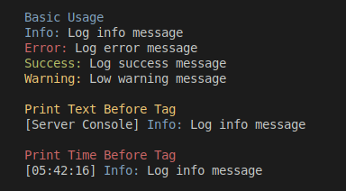

CLI Utils
=========

Installation
-----

`git clone repo`

`pip install -r requirements.txt`

Usage
-----

Colored prints
--------------

cprint
```python
from CLIUtils import cprint

cprint("%R%Hello%Y%, %B%World")
```


log functions

```python
from CLIUtils import log_warning, log_info, log_error, log_success, cprint

cprint("\n%B%Basic Usage")
log_info("Log info message")
log_error("Log error message")
log_success("Log success message")
log_warning("Low warning message")
cprint("\n%Y%Print Text Before Tag")
log_info("Log info message", "[Server Console] ")
cprint("\n%R%Print Time Before Tag")
log_info("Log info message", print_time=True)

```


Questionary
===========


